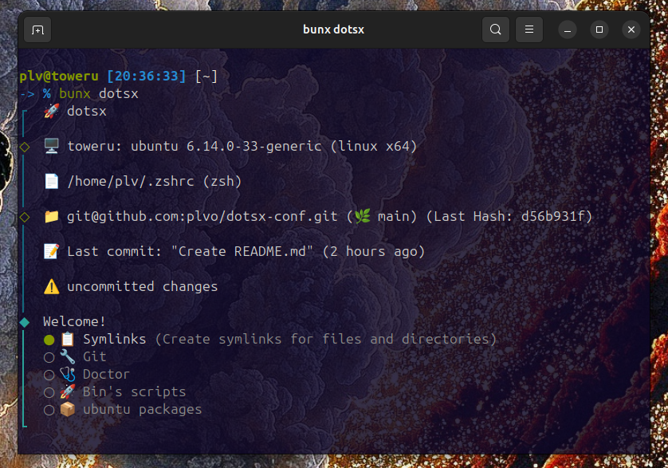
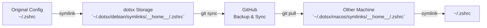

# dotsx

A CLI tool to sync and manage your dotfiles across all your machines.




## ⚠️ Disclaimer

> **This project is currently under active development and not yet production-ready:**
> - Git commands and symlink operations are not fully tested (coverage ~70-80%)
> - Do NOT DELETE `~/.dotsx` without first creating a backup, as it contains the content of your files.
> - You **must** initialize a GitHub repository
> - The `dotsx backup` command is coming soon

## 🚀 Quick Start

```bash
# Run directly without installation
bunx dotsx
npx dotsx
pnpm dlx dotsx

# Or install globally
bun add -g dotsx
npm install -g dotsx
pnpm add -g dotsx
```

## 🎯 The Problem

Managing configuration files (dotfiles) across multiple machines is challenging:
- **Synchronization**: Manually copying `.zshrc`, `.vimrc`, IDE settings between machines
- **Version Control**: No history of configuration changes
- **Backup**: Risk of losing configurations when switching machines
- **Organization**: Scattered config files across the filesystem
- **Multi-OS**: Different paths for the same tool (Linux vs macOS)

## ✨ The Solution

**dotsx** centralizes and version-controls all your configurations in `~/.dotsx`:
- ✅ **Unified Management**: All dotfiles in one place
- ✅ **Git-Backed**: Full version history and synchronization via GitHub
- ✅ **Automatic Symlinks**: Original locations point to centralized configs
- ✅ **Multi-OS Support**: OS-specific configurations (Debian, Arch, macOS, etc.)
- ✅ **Backup System**: Automatic daily backups before modifications
- ✅ **Script Management**: Centralized executable scripts with auto-aliasing

## 🏗️ Technical Architecture

### How It Works



### Structure Overview

```
~/.dotsx/
  └── <os>/                    # OS/distro name (debian, arch, macos, etc.)
      ├── dotsx.config.json    # OS-specific configuration
      ├── bin/                 # Executable shell scripts
      │   └── dotsx.bin.aliases
      ├── packages/            # Package manager metadata
      │   └── dotsx.packages.json
      └── symlinks/            # All symlinked configurations
          └── __home__/        # User home directory paths
              ├── .zshrc
              ├── .config/Code/User/settings.json
              └── .claude/CLAUDE.md
```

## 🛠️ Features

### 1. Symlink Management

**What it does:** Creates symbolic links from your original config locations to centralized dotsx storage.

**How it works:**

1. **Path Normalization**: Converts system paths to portable format
   ```
   ~/.zshrc → ~/.dotsx/debian/symlinks/__home__/.zshrc
   ```
   The `__home__` prefix replaces `~` for user-agnostic storage.

2. **Symlink Creation Process**:
   - Detects original file location (e.g., `~/.zshrc`)
   - Creates backup in `~/.backup.dotsx/` (timestamped)
   - Moves original file to `~/.dotsx/<os>/symlinks/__home__/.zshrc`
   - Creates symlink: `~/.zshrc → ~/.dotsx/<os>/symlinks/__home__/.zshrc`

3. **Integrity Checking**:
   - Scans all files in `~/.dotsx/<os>/symlinks/`
   - Verifies each symlink exists and points to correct location
   - Detects broken/missing symlinks and offers automatic repair

---

### 2. Git Integration

**What it does:** Version-controls your dotfiles on GitHub with SSH authentication.

**How it works:**

1. **Initial Setup**:
   - Initializes Git repository in `~/.dotsx/`
   - Requires GitHub SSH connection (SSH keys must be configured)
   - Sets remote: `git@github.com:username/dotsx.git`

2. **Sync Operation** (`dotsx git sync`):
   ```bash
   # Internally executes:
   git add -A                                      # Stage all changes
   git commit -m "update dotsx [timestamp]"        # Commit with timestamp
   git push origin main                            # Push to remote
   ```

3. **Pull Operation** (`dotsx git pull`):
   ```bash
   # Internally executes:
   git pull origin main                            # Fetch updates
   # Then validates:
   - Checks for merge conflicts
   - Verifies symlink integrity
   - Offers to fix broken symlinks
   ```

4. **Conflict Resolution**:
   - Detects conflicts during pull
   - Prompts user to resolve manually
   - After resolution, user runs `dotsx check` to validate

**Security:** Only SSH authentication is supported (no HTTPS tokens).

---

### 3. Script Management (`bin/`)

**What it does:** Centralizes executable shell scripts with automatic aliasing.

**How it works:**

1. **Script Storage**:
   - Scripts are stored as native files (not symlinks) in `~/.dotsx/<os>/bin/`
   - Example: `~/.dotsx/debian/bin/deploy.sh`

2. **Automatic Aliasing**:
   - dotsx scans `bin/` directory
   - Generates aliases in `~/.dotsx/<os>/bin/dotsx.bin.aliases`:
     ```bash
     alias deploy="~/.dotsx/debian/bin/deploy.sh"
     alias backup="~/.dotsx/debian/bin/backup.sh"
     ```
   - Alias file is auto-sourced in shell RC (`.zshrc` or `.bashrc`)

3. **Execution Flow**:
   ```mermaid
   graph LR
       A[User types: deploy] --> B[Shell reads alias]
       B --> C[Executes: ~/.dotsx/debian/bin/deploy.sh]
   ```

4. **Setup Process**:
   ```bash
   # 1. Add script manually
   echo '#!/bin/bash\necho "Deploying..."' > ~/.dotsx/debian/bin/deploy.sh

   # 2. Run dotsx bin
   dotsx bin
   # Makes executable (chmod +x)
   # Generates alias
   # Sources in ~/.zshrc

   # 3. Use from anywhere
   deploy  # Works from any directory
   ```

**Cleanup:** If a script is deleted, its alias is automatically removed from `dotsx.bin.aliases`.

---

### 4. Package Management

**What it does:** Tracks installed packages per OS, with separate text files per package manager.

**How it works:**

1. **Package Detection**:
   - Detects OS/distro on initialization
   - Identifies available package managers (apt, brew, pacman, etc.)
   - Each package manager has its own `.txt` file

2. **Storage Format** (`~/.dotsx/<os>/packages/`):
   ```
   ~/.dotsx/debian/packages/
     ├── apt.txt         # One package per line
     ├── snap.txt
     └── flatpak.txt

   ~/.dotsx/macos/packages/
     └── brew.txt

   ~/.dotsx/arch/packages/
     ├── pacman.txt
     └── yay.txt
   ```

   **Example `apt.txt`:**
   ```txt
   git
   curl
   tmux
   neovim
   ```

3. **Package Manager Operations** (`dotsx packages`):
   - **Select package manager**: Choose from available managers (apt, snap, brew, etc.)
   - **Check status**: Scans `.txt` file and checks each package installation status
     ```bash
     # For apt packages:
     dpkg -s git         # Check if installed
     dpkg -s curl        # Check if installed
     ```
   - **Install missing**: Prompts to install packages not yet installed
     ```bash
     sudo apt install -y tmux
     ```
   - **Remove installed**: Prompts to remove packages currently installed
     ```bash
     sudo apt remove -y neovim
     ```

4. **Workflow**:
   ```mermaid
   sequenceDiagram
       participant User
       participant dotsx
       participant PackageFile as apt.txt
       participant System

       User->>dotsx: dotsx packages
       dotsx->>User: Select package manager
       User->>dotsx: apt
       dotsx->>PackageFile: Read package list
       PackageFile->>dotsx: [git, curl, tmux, neovim]
       dotsx->>System: Check installation status
       System->>dotsx: git ✅, curl ✅, tmux ❌, neovim ❌
       dotsx->>User: Show status + prompt action
       User->>dotsx: Install missing packages
       dotsx->>System: sudo apt install -y tmux neovim
   ```

5. **Sync Across Machines**:
   - Package lists (`.txt` files) are version-controlled in Git
   - `git sync` backs up your package lists to GitHub
   - `git pull` on new machine downloads package lists
   - Run `dotsx packages` to install missing packages

#### Supported Systems

| OS/Distro | Package Managers |
|-----------|------------------|
| **macOS** | `brew` |
| **Debian/Ubuntu** | `apt`, `snap`, `flatpak` |
| **Mint/Kali/Pop/Zorin/Deepin/Elementary/Endless/Parrot/Raspbian** | `apt`, `snap`, `flatpak` |
| **Fedora/RHEL/CentOS/Rocky/AlmaLinux/Oracle/Amazon Linux** | `dnf`, `yum` |
| **Arch/Manjaro** | `pacman`, `yay` |
| **Alpine** | `apk` |

---

## 🤝 Contributing

Contributions are welcome!

## 📄 License

This project is licensed under the MIT License - see the [LICENSE](LICENSE) file for details.

